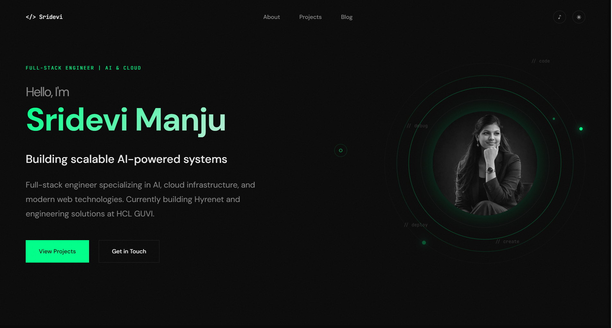

# 👩‍💻 Sridevi Manju - Portfolio

A modern, minimalist portfolio website showcasing my work as a Full-Stack Engineer specializing in AI, cloud infrastructure, and modern web technologies.

[](https://www.sridevi.me/)
[](https://nextjs.org/)
[](https://www.typescriptlang.org/)
[](LICENSE)




## 🛠️ Tech Stack

- **Framework:** [Next.js 14](https://nextjs.org/) (App Router)
- **Language:** [TypeScript](https://www.typescriptlang.org/)
- **Styling:** CSS Modules with CSS Custom Properties
- **Fonts:** JetBrains Mono, DM Sans
- **Deployment:** [Vercel](https://vercel.com/)

## 📂 Project Structure

```
sridevi-portfolio/
├── src/
│   ├── app/
│   │   ├── globals.css           # Global styles & CSS variables
│   │   ├── layout.tsx            # Root layout with metadata
│   │   ├── page.tsx              # Home page
│   │   └── blog/
│   │       ├── page.tsx          # Blog listing page
│   │       └── [slug]/
│   │           └── page.tsx      # Individual blog post
│   └── components/
│       ├── About.tsx             # About section
│       ├── CustomCursor.tsx      # Custom cursor effect
│       ├── Footer.tsx            # Footer with social links
│       ├── Header.tsx            # Navigation header
│       ├── Hero.tsx              # Hero section with orbit animation
│       └── Projects.tsx          # Featured projects grid
├── public/
│   ├── images/
│   │   ├── profile.png           # Profile image
│   │   └── preview.png           # Site preview image
│   └── music/                    # Background music files
├── .gitignore
├── package.json
├── tsconfig.json
└── README.md
```

## 🚀 Getting Started

### Prerequisites

- Node.js 18 or higher
- npm or yarn package manager

### Installation

1. **Clone the repository**
   ```bash
   git clone https://github.com/sridevi14/sridevi-portfolio.git
   cd sridevi-portfolio
   ```

2. **Install dependencies**
   ```bash
   npm install
   # or
   yarn install
   ```

3. **Run the development server**
   ```bash
   npm run dev
   # or
   yarn dev
   ```

4. **Open your browser**
   
   Navigate to [http://localhost:3000](http://localhost:3000)


### Add Your Profile Image

Replace `public/images/profile.png` with your own image.

### Add Background Music

1. Add your music file to `public/music/`
2. Update the audio source in your component

## 📝 Adding Blog Posts

To add a new blog post:

1. Create a new route in `src/app/blog/[slug]/`
2. Or use a dynamic blog system with MDX (recommended - see [setup guide](./docs/blog-setup.md))

## 📦 Build for Production

```bash
npm run build
npm start
```


## 🤝 Contributing

While this is a personal portfolio, suggestions and feedback are welcome!

1. Fork the repository
2. Create your feature branch (`git checkout -b feature/AmazingFeature`)
3. Commit your changes (`git commit -m 'Add some AmazingFeature'`)
4. Push to the branch (`git push origin feature/AmazingFeature`)
5. Open a Pull Request

## 📄 License

This project is open source and available under the [MIT License](LICENSE).

## 📬 Contact

**Sridevi Manju** - Full-Stack Engineer | AI & Cloud

- 🌐 Website: [sridevimanju.dev](https://www.sridevi.me/)
- 📧 Email: [sridevimanjuraja@gmail.com](mailto:sridevimanjuraja@gmail.com)
- 💼 LinkedIn: [@sridevimanjuraja](https://www.linkedin.com/in/sridevimanjuraja/)
- 💻 GitHub: [@sridevi14](https://github.com/sridevi14)
- 📸 Instagram: [@sridevi.tech](https://www.instagram.com/sridevi.tech/)

## 🙏 Acknowledgments

- Design inspiration from modern developer portfolios
- Built with ❤️ using Next.js and TypeScript
- Fonts: [JetBrains Mono](https://www.jetbrains.com/lp/mono/), [DM Sans](https://fonts.google.com/specimen/DM+Sans)

---

⭐ **If you found this helpful, consider giving it a star!**

☕ **[Buy me a coffee](https://buymeacoffee.com/sridevi14)**

---

**Made with 💚 by Sridevi Manju** | © 2026 All rights reserved

